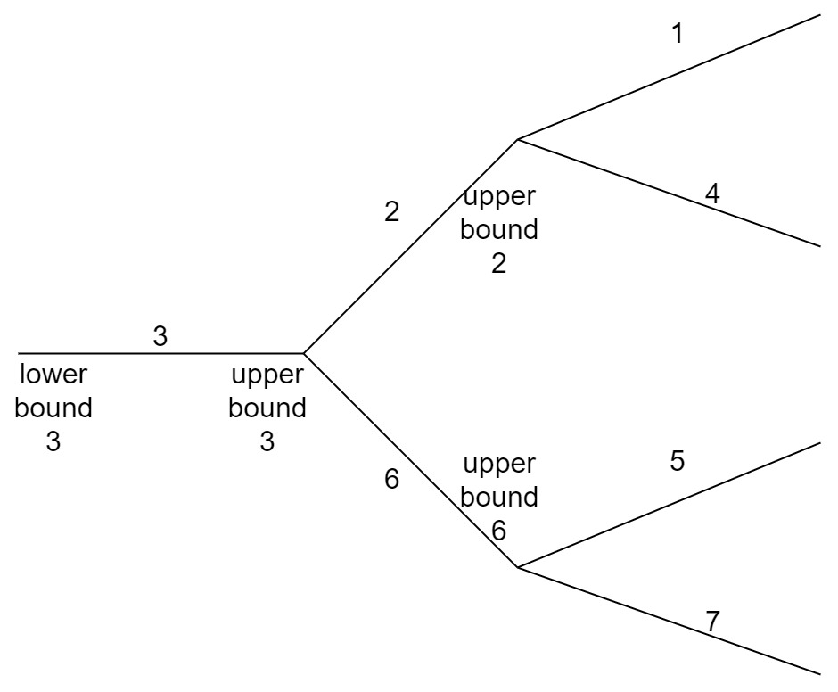
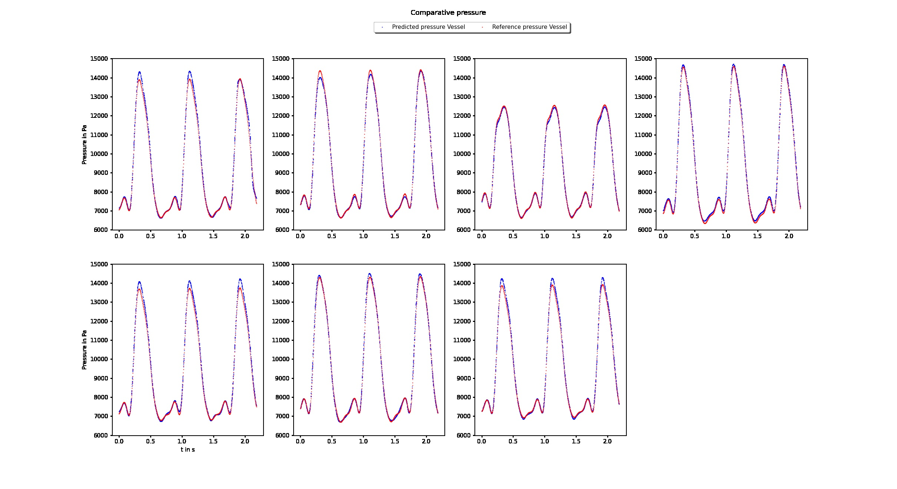
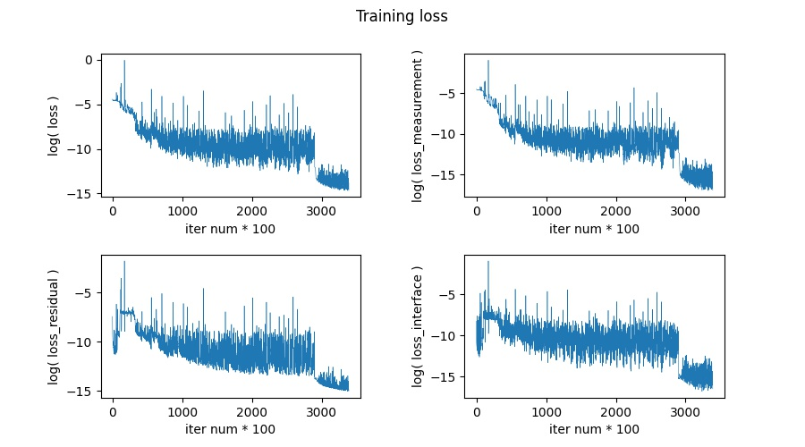

# 1DBloodFlowPINNs-pelvic-pytorch

## 简介

本项目将[PredictiveIntelligenceLab/1DBloodFlowPINNs](https://github.com/PredictiveIntelligenceLab/1DBloodFlowPINNs)中的Pelvic部分使用pytorch复现。

原项目是论文《Georgios Kissas, Yibo Yang, Eileen Hwuang, Walter R. Witschey, John A. Detre, Paris Perdikaris. "[Machine  learning in cardiovascular flows modeling: Predicting pulse wave  propagation from non-invasive clinical measurements using  physics-informed deep learning.](https://www.sciencedirect.com/science/article/pii/S0045782519305055?dgcid=author)" (2019).》的代码。该论文使用PINN(physics informed neural network)神经网络结构求解Navier-Stokes方程，从而计算主动脉中的血压分布。

注意：代码中的血管序号与论文中的不一致。本代码中的序号和数据均与[PredictiveIntelligenceLab/1DBloodFlowPINNs](https://github.com/PredictiveIntelligenceLab/1DBloodFlowPINNs)保持一致，血管序号和其中的lower bound, upper bound位置如下图所示：

下面介绍本项目中的代码。

## 代码

### 文件及运行方法

- `/data`：用到的数据。
- `/pyfile1207`：某次训练后的结果，仅供参考。包括`result_loss`，`result_model`，`result_Pressure`，`result_Velocity`。这些文件夹说明见下方。
- `/result_loss`：储存训练过程中的loss变化。使用`draw_log_loss.py`可以画图。
- `/result_model`：储存训练得到的模型。使用`net.py`中的predict函数可以调用并测试。
- `/result_Pressure`：在训练过程，使用当前的模型进行预测，并于有限元计算的结果进行对比。
- `/result_Velocity`：与上一个类似，分别计算的是pressure和velocity的值。
- `dataset.py`：将数据制作成pytorch需要的dataset的形式。
- `draw_log_loss.py`：画出训练过程中loss变化图。
- `loss.py`：PINN中的定义损失函数。
- `net.py`：PINN网络结构。
- `test.py`：使用训练好的模型预测。
- `train.py`：训练脚本。
- `utility.py`：功能函数。

运行方法：

- 训练前清空`result_Pressure`、`result_Velocity`、`result_loss`、`result_model`。不清空也没关系，会自动覆盖。如果要保留训练结果，需要将这些文件储存到别的地方。
- 运行`train.py`即可。
- 训练过程中可查看`result_Velocity`和`result_Pressure`，观察模型训练情况。
- 训练结束后，运行`draw_log_loss.py`，可在`result_loss/log_loss_4.jpg`查看损失函数变化情况。
- 训练结束后，可使用`test.py`，使用训练好的模型进行预测。

### requirements

- pytorch 1.7,1+cuda101 ，安装：`pip install torch==1.7.1+cu101 torchvision==0.8.2+cu101 torchaudio===0.7.2 -f https://download.pytorch.org/whl/torch_stable.html`
- numpy
- matplotlib
- os
- json

### PINN

网络结构为全连接层，代码为`net.py`。

损失函数为NS方程残差的均方误差、测量值的均方误差、连接点约束的均方误差之和，详细设置参考论文，代码为`loss.py`。

损失函数中需要的偏导数使用`torch.autograd.grad()`计算，代码为`train.py`中170行前后。

### 训练和测试

训练脚本为`train.py`。训练参数为，先使用lr=1e-3训练290000次，再使用lr=1e-4训练50000次。训练时间约为44小时，占用显存不到1GB。原tensorflow程序运行时间为7小时，时间较长的原因可能是因为本程序每次训练过程中七个网络依次计算，如果使用7个gpu改为并行计算可能可以大大提升训练速度。

测试脚本为`test.py`，可自定义x，t，i_vessel。

## 结果

pyflie1207保存了一次训练得到的结果，这次训练使用的超参数设置（学习率、参数初始化方法等）与原tensorflow程序相同。

训练后的模型在论文中设定的test points位置的预测结果如下图所示：

图中展示了7个血管中test points位置的血压随时间按变化的情况。其中红色曲线为有限元方法计算的参考结果，蓝色曲线为使用神经网络计算的结果。

这次训练过程中损失函数变化如下图所示：

数值结果和损失函数变化曲线都基本与原tensorflow程序相同。

但使用神经网络的缺点是模型结构、学习率等超参数不容易确定，如果设定不好容易陷入局部最优解，在求解偏微分方程的问题中影响很大。下图和调试过程中某次更改学习率变化策略后的结果，虽然损失函数变化看起来正常，但预测的血压函数在测试点的值与参考结果相差很大。

